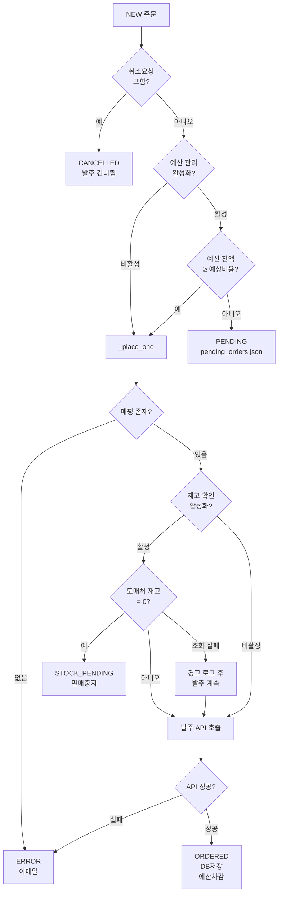
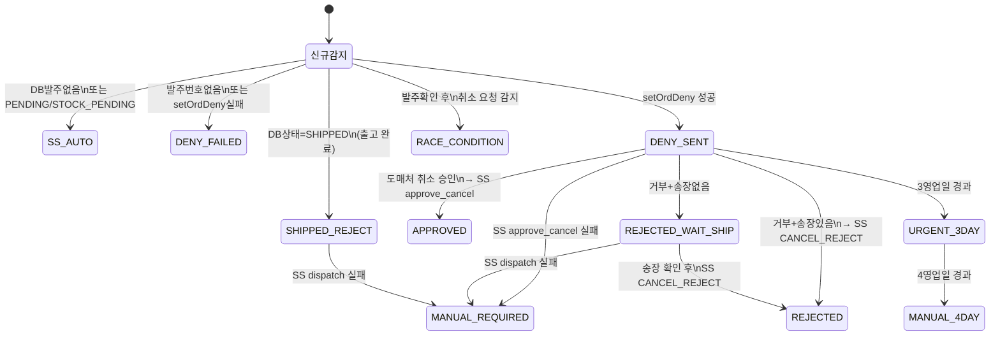
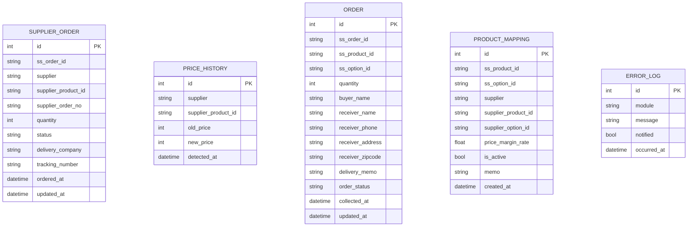
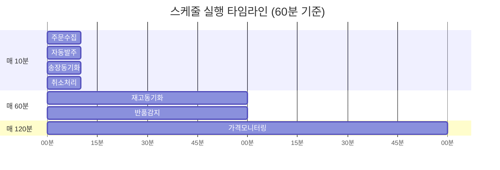
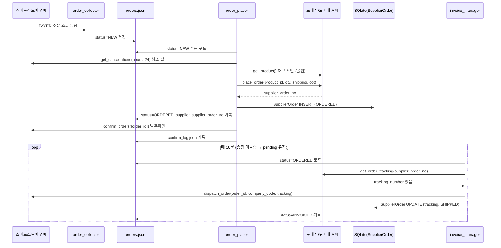
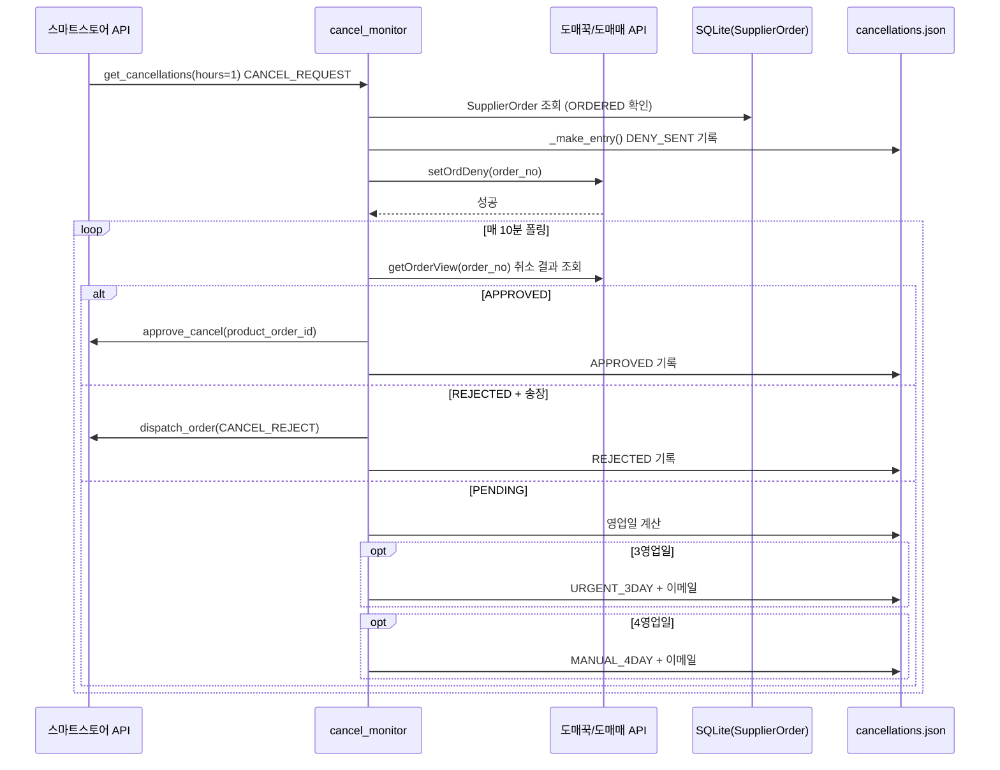
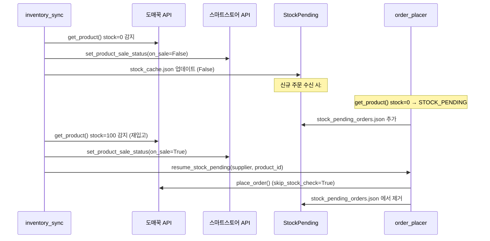

# 시스템 마스터 명세서 (SYSTEM MASTER SPECIFICATION)
## 스마트스토어 드롭셔핑 자동화 시스템

> **버전**: 2026-05-31 기준  
> **분류**: 기술 내부 문서  
> **언어**: Python 3.14  

---

## 목차

1. [구현된 기능 목록](#1-구현된-기능-목록)
2. [기능 상세](#2-기능-상세)
3. [운영 절차](#3-운영-절차)
4. [단계별 로직](#4-단계별-로직)
5. [분기 로직 & 결정 트리](#5-분기-로직--결정-트리)
6. [엣지 케이스 & 시나리오](#6-엣지-케이스--시나리오)
7. [파일 목록 & 역할](#7-파일-목록--역할)
8. [모듈 의존성 맵](#8-모듈-의존성-맵)
9. [데이터베이스 스키마 & 데이터 모델](#9-데이터베이스-스키마--데이터-모델)
10. [이메일 & 알림 시스템](#10-이메일--알림-시스템)
11. [대시보드 기능](#11-대시보드-기능)
12. [외부 API 통합](#12-외부-api-통합)
13. [작업 스케줄러](#13-작업-스케줄러)
14. [에러 처리 전략](#14-에러-처리-전략)
15. [설정 분석](#15-설정-분석)
16. [End-to-End 데이터 흐름](#16-end-to-end-데이터-흐름)
17. [의존성 & 환경](#17-의존성--환경)
18. [보안 & 인증](#18-보안--인증)

---

## 1. 구현된 기능 목록

| 번호 | 기능명 | 실행 주기 | 상태 |
|:---:|--------|:---------:|:----:|
| 1 | **주문 수집** | 매 10분 | ✅ 완전 구현 |
| 2 | **자동 발주** | 매 10분 | ✅ 완전 구현 |
| 3 | **SS 발주확인** | 발주 직후 (배치) | ✅ 완전 구현 |
| 4 | **송장 동기화** | 매 10분 | ✅ 완전 구현 |
| 5 | **재고 동기화** | 매 60분 | ✅ 완전 구현 |
| 6 | **가격 모니터링** | 매 120분 | ✅ 완전 구현 |
| 7 | **반품 감지** | 매 60분 | ✅ 완전 구현 |
| 8 | **취소 요청 자동 처리** | 매 10분 | ✅ 완전 구현 |
| 9 | **예산 관리** | 발주 시 실시간 | ✅ 완전 구현 |
| 10 | **재고부족 대기 & 재개** | 재고 동기화 연동 | ✅ 완전 구현 |
| 11 | **예산 대기 & 재개** | CLI 충전 시 | ✅ 완전 구현 |
| 12 | **상품 자동 등록** | 수동 (대시보드) | ✅ 완전 구현 |
| 13 | **이메일 알림** | 이벤트 기반 | ✅ 완전 구현 |
| 14 | **웹 대시보드** | 상시 (Flask) | ✅ 완전 구현 |
| 15 | **영상 초안 제작** | 수동 (대시보드) | ✅ 구현 (Whisper AI) |

---

## 2. 기능 상세

### 2.1 주문 수집 (Order Collector)

스마트스토어 커머스 API에서 최근 1일(24시간) 이내 `PAYED` 상태의 상품주문을 조회하여 `data/orders.json`에 저장한다.

**수집 필드 (15개)**:
- `order_id`: `productOrderId` — 상품주문번호 (시스템 내 고유 키)
- `ss_order_id`: `orderId` — 상위 주문번호 (여러 상품을 하나의 장바구니로 묶은 번호)
- `product_id`: `productId` — 스마트스토어 상품 ID
- `product_name`: `productName` — 상품명
- `option_code`: `optionCode` → `optionId` 폴백 — 옵션 코드
- `quantity`: `quantity` — 주문 수량
- `buyer_name`: `ordererName` — 구매자명
- `receiver_name`: `shippingAddress.name` — 수령인명
- `receiver_phone`: `shippingAddress.tel1` → `tel2` 폴백 — 수령인 전화번호
- `receiver_address`: `shippingAddress.addressStr` — 전체 주소
- `receiver_zipcode`: `shippingAddress.zipCode` — 우편번호
- `delivery_memo`: `deliveryMemo` — 배송 메모
- `status`: 내부 상태값 (초기값 `"NEW"`)
- `collected_at`: 수집 시각 (ISO8601)
- `updated_at`: 최근 상태변경 시각 (ISO8601)

**동적으로 추가되는 필드** (발주 완료 후 `update_supplier_info` 호출 시):
- `supplier`: `"domaekkuk"` | `"domaemae"`
- `supplier_order_no`: 도매처 발주번호

### 2.2 자동 발주 (Order Placer)

`status="NEW"` 인 주문을 대상으로 도매처(도매꾹/도매매)에 자동 발주한다.  
**예산 관리 모드**와 **무제한 모드** 두 가지로 동작한다.

**예산 관리 모드** (`budget > 0`):
- 각 주문의 예상 비용(도매처 단가 × 수량 + 배송비 3,000원)을 계산
- 비용 오름차순 정렬 후 그리디(Greedy) 알고리즘으로 예산 내 최대 발주
- 초과 주문은 `PENDING` 상태로 `pending_orders.json`에 저장
- 예산 차감 후 `budget.json` 업데이트

**무제한 모드** (`budget = 0`):
- 모든 NEW 주문을 순차 발주, 예산 제한 없음

**옵션 전달 방식**:
- **도매꾹**: 매핑의 `supplier_option_id` → `addOrder` 요청의 `opt` 필드
- **도매매**: 매핑의 `supplier_option_id` → `item[0][option]` 직접 전달  
  `supplier_option_id` 없으면 SS `option_code` → 옵션명 텍스트 매칭 폴백

### 2.3 SS 발주확인

발주 성공한 주문 ID를 30건씩 배치로 스마트스토어 `confirm_orders` API에 전송한다.  
발주확인이 완료된 주문 ID는 `data/confirm_log.json`에 누적 저장한다.  
(취소 레이스 컨디션 감지에 활용됨)

### 2.4 송장 동기화 (Invoice Manager)

`status="ORDERED"` 인 주문에 대해 도매처에서 송장번호를 조회하여 스마트스토어 `dispatch_order` API로 등록한다.

**택배사 코드 매핑** (`DELIVERY_COMPANY_MAP`):

| 도매처 택배사명 | SS 코드 |
|--------------|--------|
| CJ대한통운 / CJ로지스틱스 | CJGLS |
| 롯데택배 / 롯데글로벌로지스틱스 | LOTTE |
| 한진택배 | HANJIN |
| 우체국택배 | EPOST |
| 로젠택배 | LOGEN |
| GS편의점택배 | GS25 |
| 쿠팡로지스틱스 | COUPANG |
| 홈픽 | HOMEPICK |
| 경동택배 | KDEXP |
| 대신택배 | DAESIN |
| 일양로지스 | ILYANG |

### 2.5 재고 동기화 (Inventory Sync)

활성 매핑 전체를 순회하며 도매처 재고를 확인한다.  
**상태 캐시** (`data/stock_cache.json`):
```json
{
  "status": {"domaekkuk:12345": true, "domaemae:67890": false},
  "low_stock_alerted_at": {"domaekkuk:12345": "2026-05-14T10:00:00+00:00"}
}
```
- 이전 실행과 재고 상태 동일 → SS API 호출 생략
- 품절 감지 → SS 판매중지 + 이메일
- 재입고 감지 → SS 판매재개 + 재고부족 대기 주문 재발주
- 재고 50개 미만 → 재고부족 이메일 (60분 쿨다운)

### 2.6 가격 모니터링 (Price Monitor)

활성 매핑 전체의 도매처 단가를 DB `PriceHistory`와 비교한다.  
**설계 의도**: 가격 변동은 이메일을 발송하지 않고, `price_alerts.json`과 DB에만 기록한다.  
조회 오류 발생 시에만 이메일 발송.

### 2.7 반품 감지 (Return Monitor)

SS `get_returns(hours=1)` → `RETURN_REQUEST` 상태 주문을 1시간 주기로 감지.  
신규 반품은 `data/returns.json`에 누적 저장하고 이메일로 알림.

**수집 필드 (27개)**:
주문 식별(2) + 상품(7) + 구매자/수령인(9) + 기존발송(2) + 반품(4) + 환불(3) + 메타(1)

### 2.8 취소 요청 자동 처리 (Cancel Monitor)

SS `get_cancellations(hours=1)` → `CANCEL_REQUEST` 상태를 1시간마다 감지.  
발주 상태에 따라 3가지 경로로 라우팅하고, 영업일 기반 폴링을 통해 자동 처리한다.

**취소 상태 코드 전체 목록**:

| 상태 코드 | 의미 |
|----------|------|
| `SS_AUTO` | 도매처 발주 없음 → SS 자동 처리 |
| `DENY_SENT` | setOrdDeny 전송 완료, 도매처 응답 대기 |
| `DENY_FAILED` | setOrdDeny 전송 실패 (발주번호 없음 or API 오류) |
| `APPROVED` | 도매처 취소 승인 → SS 취소승인 완료 |
| `REJECTED` | 도매처 취소 거부 → SS dispatch(CANCEL_REJECT) 완료 |
| `REJECTED_WAIT_SHIP` | 도매처 거부, 송장 대기 중 |
| `SHIPPED_REJECT` | 출고 완료 건 → SS CANCEL_REJECT 처리 |
| `URGENT_3DAY` | 3영업일 경과, 긴급 알림 중 |
| `MANUAL_4DAY` | 4영업일 경과, 수동 처리 필요 |
| `RACE_CONDITION` | 발주확인 후 즉시 취소 요청 감지 |
| `MANUAL_REQUIRED` | SS API 실패 → 수동 처리 필요 |

### 2.9 예산 관리 (Budget Manager)

`data/budget.json` 기반 실시간 예산 관리 시스템.

```json
{
  "current_balance": 482000,
  "total_spent": 18000,
  "total_charged": 500000,
  "history": [
    {"type": "charge", "amount": 500000, "reason": "초기 예산", "balance_after": 500000, "at": "..."},
    {"type": "deduct", "amount": -18000, "reason": "발주 완료", "order_id": "...", "balance_after": 482000, "at": "..."}
  ]
}
```

### 2.10 상품 자동 등록 (Product Register)

도매꾹/도매매 URL을 입력받아 상품 정보를 수집하고 스마트스토어에 자동 등록한다.

**수집 방식 이중화**:
1. **1차**: 공식 API (`getItemView`) 호출
2. **2차 (Fallback)**: HTML 스크래핑 (EUC-KR 인코딩, BeautifulSoup)

**수집 항목**: 상품명, 공급가, 재고, 원산지, 모델명, KC인증(번호/유형/기관), 카테고리, 대표이미지, 서브이미지, 상세이미지, HTML, 옵션

**카테고리 자동 매핑**:
- `data/category_mapping_cache.json` 캐시 우선 조회
- 캐시 미스 → SS `find_leaf_category()` API 검색 (세부→대분류 역순)
- 실패 시 등록 중단 (잘못된 카테고리 방지)

**KC인증 처리**:
- 카테고리가 KC 필수 → `kc_cert_no` + `kc_cert_agency` + `kc_cert_info_id` 확인
- 누락 시 등록 즉시 중단, 사유 반환

---

## 3. 운영 절차

### 3.1 시스템 시작 절차

```
1. python main.py 실행
2. config/settings.yaml 로드
3. data/orders.db SQLite 초기화 (테이블 생성)
4. API 클라이언트 인스턴스 생성:
   - SmartstoreAPI (bcrypt 서명 기반 OAuth2)
   - DomaekkukAPI (api_key + uid + pwd)
   - DomaemaeClient (sId 세션 기반)
5. 7개 스케줄 작업 등록 (run_now=True → 즉시 1회 실행)
6. Flask 대시보드 별도 스레드 시작 (포트 2713)
7. 상태 출력 스레드 시작 (10분마다 다음 실행 시각 출력)
8. Ctrl+C → SIGINT 처리 → 스케줄러 graceful shutdown
```

### 3.2 매핑 등록 절차

```
1. 대시보드 [매핑 관리] 탭 접속
2. 스마트스토어 상품 ID 입력 → [확인] 클릭 → SS 상품명 조회
3. 도매처 선택 (도매꾹/도매매) + URL 또는 상품번호 입력
4. SS 옵션 ID (옵션 상품인 경우), 도매처 옵션 코드 입력
5. 마진율 설정 (기본 1.3 = 30%)
6. 저장 → mappings.json 기록
```

### 3.3 예산 충전 절차

```
방법 A: CLI
  python add_budget.py 500000 "2차 충전"
  → 충전 → budget.json 업데이트
  → pending_orders.json 대기 주문 자동 재개 시도

방법 B: 대시보드
  [예산 관리] 탭 → 금액 입력 → 충전하기
  → POST /api/budget/charge → budget.json 업데이트
  (대기 주문 자동 재개는 CLI 방식에만 적용)
```

---

## 4. 단계별 로직

### 4.1 주문 수집 상세 실행 단계

```
OrderCollector.run()
├── 1. api.get_orders(status="PAYED", days=1) 호출
│   ├── SS API: GET /v1/pay-order/.../last-changed-statuses
│   │   (lastChangedFrom ~ lastChangedTo, 24시간 단위 분할, 0.3초 간격)
│   │   → product_order_id 목록 수집
│   └── SS API: POST /v1/pay-order/.../query
│       (product_order_ids 배열) → 상세 정보 조회
├── 2. 각 항목 _parse_order_item(raw) 정규화
│   ├── po = raw["productOrder"] (중첩 또는 flat 모두 지원)
│   ├── ord_ = raw["order"]
│   ├── addr = raw["shippingAddress"]
│   └── 15개 필드 추출 → dict 반환 (order_id 없으면 None 반환, skip)
├── 3. repo.add_many(parsed)
│   ├── 기존 known_ids와 중복 체크 (set 조회, O(1))
│   ├── 신규만 orders.json에 append
│   └── 추가 건수 반환
└── 4. 로그: "주문 수집 완료: API N건 중 신규 M건 저장"
```

### 4.2 자동 발주 상세 실행 단계

```
OrderPlacer.run()
├── 1. orders.find_by_status("NEW") → new_orders 로드
├── 2. _filter_cancel_requests(new_orders, stats)
│   ├── SS api.get_cancellations(hours=24) 호출
│   ├── cancel_ids = {productOrderId}
│   └── 각 order에서 cancel_ids 포함 시:
│       update_status("CANCELLED"), stats["cancelled"] += 1
├── 3a. 예산 없음: _place_one(order) 순차 호출
└── 3b. 예산 있음: _run_with_budget(orders, stats, to_confirm)
    ├── balance = budget.get_balance()
    ├── 각 order에서:
    │   ├── mapping 조회 (없으면 error)
    │   └── _estimate_cost(mapping, quantity)
    │       = client.get_product() → price × qty + 3000
    │       (조회 실패 시 cost=0 — 예산 오차감 방지)
    ├── costed.sort(key=cost) — 오름차순
    ├── 그리디 선택:
    │   running + cost ≤ balance → to_place
    │   초과 → to_defer
    ├── to_place → _place_one() 각각 호출
    │   성공 시 budget.deduct(cost) 호출
    └── to_defer → pending.add_many() + 이메일

_place_one(order, mapping, skip_stock_check=False)
├── 1. mapping 없으면 → error + 이메일
├── 2. stock_pending 활성화 & skip_stock_check=False:
│   ├── client.get_product(supplier_pid).stock
│   ├── stock == 0 → _handle_stock_pending()
│   └── 조회 실패 → 경고 로그 후 발주 계속
├── 3. shipping dict 구성:
│   {name, phone, address, zipcode, memo}
├── 4. supplier_option_id 결정:
│   ├── domaekkuk: supplier_option_id → kwargs["supplier_option_id"]
│   └── domaemae:
│       ├── supplier_option_id → kwargs["option_id"]
│       └── 없으면 SS option_code → kwargs["option_name"] (경고 로그)
├── 5. client.place_order(product_id, qty, shipping, **kwargs)
│   실패 → error + 이메일
└── 6. 성공:
    ├── SupplierOrder DB insert (status=ORDERED)
    ├── orders.update_supplier_info(order_id, supplier, order_no)
    └── orders.update_status(order_id, "ORDERED")

to_confirm 수집 후:
└── _run_ss_confirm(to_confirm, stats)
    ├── 30건씩 배치 SS confirm_orders() 호출
    ├── 성공 → _save_confirm_log(confirmed_ids)
    └── 실패 → 이메일 알림
```

### 4.3 송장 동기화 상세 실행 단계

```
InvoiceManager.run()
├── 1. orders.find_by_status("ORDERED") 로드
└── 2. 각 order → _sync_one(order)
    ├── order_id, supplier, supplier_order_no 추출
    ├── supplier/supplier_order_no 없으면 → error + 이메일
    ├── client.get_order_tracking(supplier_order_no)
    │   → {delivery_company, tracking_number}
    ├── tracking_number 없음 → "pending" (다음 주기 재시도)
    ├── tracking_number 있음:
    │   ├── DELIVERY_COMPANY_MAP으로 택배사 코드 변환
    │   ├── dry_run=True → 실제 API 호출 없이 "invoiced" 반환
    │   ├── ss.dispatch_order(order_id, company_code, tracking_number)
    │   │   실패 → "error" + 이메일
    │   ├── DB: SupplierOrder.tracking_number, delivery_company, status="SHIPPED"
    │   └── orders.update_status(order_id, "INVOICED")
    └── 반환: "invoiced" | "pending" | "error"
```

### 4.4 취소 처리 상세 실행 단계

```
CancelMonitor.run()
├── 1. data = _load() — cancellations.json
│   seen_ids = {r["product_order_id"]}
│
├── 2. 신규 취소 감지:
│   raw_cancels = ss.get_cancellations(hours=1)
│   각 item:
│   ├── po = item["productOrder"], claim = item["claim"]
│   ├── order_id in seen_ids → skip
│   ├── entry = _make_entry(item, po, claim)
│   │   (buyer_name, receiver_name, receiver_phone,
│   │    receiver_address, invoice_number 등 추출)
│   ├── supplier_order = _get_supplier_order(order_id)
│   │   (SupplierOrder DB에서 최신 레코드 조회)
│   └── 라우팅:
│       ├── supplier_order 없음 or status∈{CANCELLED,ERROR,""} → _route_ss_auto()
│       ├── tracking_number 있음 or status=SHIPPED → _route_shipped()
│       ├── status=ORDERED → _route_ordered()
│       └── PENDING/STOCK_PENDING 등 → _route_ss_auto()
│
├── 3. 폴링 (이미 기록된 취소 요청):
│   cancel_state ∈ {DENY_SENT, URGENT_3DAY} → _poll_deny_result()
│   cancel_state = REJECTED_WAIT_SHIP → _poll_tracking_for_rejected()
│
├── 4. 레이스 컨디션 감지:
│   _detect_race_conditions(data, seen_ids)
│   ├── confirm_log.json 최근 1시간 발주확인 목록
│   ├── ss.get_cancellations(hours=24) 24시간 취소 목록
│   └── 교집합 - seen_ids → RACE_CONDITION 엔트리 생성
│
└── 5. _save(data) — cancellations.json 저장
```

---

## 5. 분기 로직 & 결정 트리

### 5.1 발주 라우팅 결정 트리



### 5.2 취소 처리 상태 머신 (State Machine)



### 5.3 재고 동기화 결정 트리

```mermaid
flowchart TD
    A[활성 매핑] --> B[도매처 get_product]
    B -->|API 오류| C[error + 이메일]
    B -->|성공| D{재고 수량}
    D -->|0< stock <50| E{쿨다운\n60분 경과?}
    E -->|예| F[재고부족 이메일\n쿨다운 갱신]
    E -->|아니오| G[쿨다운 유지]
    D --> H{캐시와\n상태 동일?}
    H -->|동일| I[unchanged\nAPI 호출 없음]
    H -->|변경| J{in_stock?}
    J -->|False (품절)| K[SS 판매중지\n품절 이메일]
    J -->|True (재입고)| L[SS 판매재개\n재고부족 대기 재발주]
    K --> M[캐시 갱신 paused]
    L --> N[캐시 갱신 resumed]
```

### 5.4 예산 그리디 선택 로직

```python
# 정렬: 비용 오름차순 (소액 주문 우선 처리)
costed.sort(key=lambda x: x[2])  # x[2] = estimated_cost

running = 0
for order, mapping, cost in costed:
    if running + cost <= balance:
        to_place.append((order, mapping, cost))
        running += cost
    else:
        to_defer.append((order, mapping, cost))
        # balance 고갈 후 더 큰 주문도 전부 defer
```

### 5.5 도매매 옵션 매칭 우선순위

```python
# 우선순위 1: mapping["supplier_option_id"] 직접 사용
if supplier_option_id:
    kwargs["option_id"] = supplier_option_id

# 우선순위 2: SS option_code → 텍스트 매칭 폴백
elif ss_option_code:
    kwargs["option_name"] = ss_option_code
    # DomaemaeClient 내부:
    # 1. get_options(product_id) → selectOpt 파싱
    # 2. _match_option(options, option_name):
    #    - 정확 일치 (대소문자/공백 무시)
    #    - 포함 관계 (양방향)
    #    - 미매칭 → None → 옵션 없이 발주

# 우선순위 3: 옵션 없이 발주
```

---

## 6. 엣지 케이스 & 시나리오

### 6.1 품절 상태에서 주문 수신

```
시나리오: 상품이 이미 품절(STOCK_PENDING)인데 새 주문 수신

처리:
1. order_collector: orders.json에 NEW로 저장
2. order_placer._place_one:
   - get_product() → stock = 0
   - _handle_stock_pending():
     - stock_pending_orders.json에 추가
     - ss.set_product_sale_status(False) → 스마트스토어 판매중지
     - orders.update_status("STOCK_PENDING")
3. 재고 동기화에서 재입고 감지 시:
   - order_placer.resume_stock_pending() 자동 호출
   - skip_stock_check=True로 재발주
```

### 6.2 재고 조회 실패 후 발주

```
시나리오: 도매처 API 일시 장애로 재고 조회 실패

처리:
  try:
      client.get_product(supplier_pid)
  except Exception as e:
      logger.warning("재고 조회 실패 — 발주 계속 진행: %s", e)
  # 예외 처리: 재고 조회 실패 시 발주는 계속 진행
  # (품절 상태 파악 불가 → 발주 실패 위험보다 기회 손실이 큼)
```

### 6.3 취소 요청 + 발주확인 동시 발생 (Race Condition)

```
시나리오: 발주확인 완료 직후 (1시간 이내) 취소 요청 수신

감지 메커니즘:
  confirm_log.json 최근 1시간 발주확인 목록 ∩
  SS 24시간 취소 요청 목록 ≠ ∅

처리:
  → RACE_CONDITION 상태로 기록
  → 긴급 이메일: "도매처 사이트에서 직접 취소 후 SS 취소 승인"
  → 자동 처리 불가, 수동 개입 필요
```

### 6.4 이미지 업로드 Rate Limit (429)

```
시나리오: 상품 등록 시 네이버 이미지 API가 429 반환

처리 (upload_image_data):
  for attempt in range(3):
      if resp.status_code == 429:
          wait = (attempt + 1) * 3  # 3s → 6s → 9s
          time.sleep(wait)
          continue
  # 3회 모두 실패 시 → RuntimeError 발생
  # → register_product에서 캐치 → success=False 반환
```

### 6.5 SS 토큰 만료

```
시나리오: 발주 중 Bearer 토큰 만료

처리 (SmartstoreAPI._get_token):
  if self._token and time.time() < self._token_expires_at - 60:
      return self._token  # 만료 60초 전부터 갱신
  # 만료 또는 미발급 시 POST /v1/oauth2/token 재발급
  # expires_in 활용하여 만료 시각 캐시
```

### 6.6 도매매 세션 만료

```
시나리오: 도매매 sId(세션) 만료

처리 (_ensure_session):
  1. sId 없음 → _login() (setLogin 호출)
  2. loginKeepTime 초과 → _login() 재호출
  3. sIdRenewDate 30초 전 → _renew() (setLoginChk)

갱신 실패 시: requests.HTTPError → 상위 호출자에서 except
→ 발주 실패로 처리, 이메일 발송
```

### 6.7 KC인증 필수 카테고리 등록 시도

```
시나리오: KC인증 필수 카테고리에 인증 없는 상품 등록

처리 흐름:
1. resolve_category() → category_id 결정
2. get_kc_cert_status(category_id, kc_cert_type_hint)
   → (is_required=True, certInfoId=12345)
3. kc_cert_no 또는 kc_cert_agency 없음 →
   return {"success": False, "error": "KC인증 정보 누락"}
   (등록 중단, 매핑 저장 안 됨)

또는 SS API가 KC 오류 반환 시:
  _is_kc_cert_error(err_body) → True →
  return {"success": False, "error": "KC인증 필수"}
```

### 6.8 대표이미지 없는 상품

```
시나리오: 도매처 상품에 대표이미지 URL이 없음

처리:
  if not info.get("main_image"):
      return {"success": False,
              "error": "대표 이미지가 없습니다. 상품을 등록할 수 없습니다."}
  # 서브이미지/상세이미지는 없어도 등록 가능
  # 서브이미지 업로드 실패 → 경고 로그 후 계속
```

### 6.9 4영업일 이상 도매처 취소 미응답

```
시나리오: setOrdDeny 전송 후 4영업일 이상 도매처 응답 없음

처리 (_poll_deny_result):
  bdays = _business_days_since(deny_sent_at)
  if bdays >= 4 and cancel_state != "MANUAL_4DAY":
      → MANUAL_4DAY + 이메일
      "SS가 자동으로 취소 승인했을 가능성이 높습니다.
       도매처 사이트에서 주문 상태 직접 확인 필요."
```

### 6.10 예산 부족으로 전체 주문 대기

```
시나리오: 발주 예산이 소진되어 모든 주문이 PENDING

처리:
  모든 주문이 to_defer → pending_orders.json 저장
  이메일: "[긴급] 예산 부족" + 부족 금액 안내
  해결: python add_budget.py <금액> 실행
  → budget.charge() → resume_pending() 자동 호출
  → 비용 오름차순 정렬 후 예산 내 발주 재개
```

---

## 7. 파일 목록 & 역할

### 7.1 진입점

| 파일 | 역할 |
|------|------|
| `main.py` | 시스템 진입점. 설정 로드 → DB 초기화 → API 인스턴스 생성 → 스케줄러 시작 → 대시보드 스레드 시작 → 신호 처리 |
| `dashboard.py` | Flask 웹 대시보드 (포트 2713). 단독 실행 또는 main.py에서 스레드로 시작 |
| `add_budget.py` | 예산 충전 CLI. `python add_budget.py <금액> [사유]` |

### 7.2 API 클라이언트

| 파일 | 역할 |
|------|------|
| `src/api/smartstore.py` | 네이버 스마트스토어 커머스 API 클라이언트. bcrypt 서명, 토큰 캐시, 주문조회/발주/송장등록/취소/반품 |
| `src/api/domaekkuk.py` | 도매꾹 공개 API v4.1 클라이언트. 상품조회/발주(addOrder)/취소/송장조회/옵션조회 |
| `src/api/domaemae.py` | 도매매 Private API 클라이언트. sId 세션 관리, 상품/옵션/발주(setOrder)/취소/송장조회 |

### 7.3 핵심 비즈니스 로직

| 파일 | 역할 |
|------|------|
| `src/core/order_collector.py` | 주문 수집 로직. SS API → orders.json 저장 |
| `src/core/order_placer.py` | 발주 로직. 예산 관리, 재고 확인, 옵션 전달, SS 발주확인 |
| `src/core/invoice_manager.py` | 송장 동기화. 도매처 송장 조회 → SS dispatch_order |
| `src/core/inventory_sync.py` | 재고 동기화. 상태 캐시, 품절/재입고 처리 |
| `src/core/price_monitor.py` | 가격 모니터링. PriceHistory DB 비교, price_alerts.json |
| `src/core/return_monitor.py` | 반품 감지. SS RETURN_REQUEST 수집, returns.json |
| `src/core/cancel_monitor.py` | 취소 자동 처리. 상태 머신, 영업일 폴링 |
| `src/core/budget_manager.py` | 예산 잔액 관리. budget.json, 스레드 안전 |
| `src/core/product_register.py` | 상품 자동 등록. API+스크래핑, 이미지 업로드, KC인증, 카테고리 매핑 |

### 7.4 저장소 (Repository Pattern)

| 파일 | 역할 | 저장 파일 |
|------|------|----------|
| `src/core/order_repository.py` | 주문 CRUD | `data/orders.json` |
| `src/core/mapping_repository.py` | 상품 매핑 CRUD | `data/mappings.json` |
| `src/core/budget_manager.py` | 예산 잔액 & 이력 | `data/budget.json` |
| `src/core/pending_order_repository.py` | 예산 대기 주문 | `data/pending_orders.json` |
| `src/core/stock_pending_repository.py` | 재고부족 대기 주문 | `data/stock_pending_orders.json` |
| `src/core/price_alert_repository.py` | 가격 변동 알림 | `data/price_alerts.json` |

### 7.5 데이터베이스

| 파일 | 역할 |
|------|------|
| `src/db/database.py` | SQLAlchemy 엔진 초기화, get_session 컨텍스트 매니저 |
| `src/db/models.py` | ORM 모델 정의 (Order, SupplierOrder, ProductMapping, PriceHistory, ErrorLog) |

### 7.6 유틸리티

| 파일 | 역할 |
|------|------|
| `src/utils/config_loader.py` | `config/settings.yaml` 로드 |
| `src/utils/scheduler.py` | APScheduler BackgroundScheduler 래퍼 |
| `src/utils/logger.py` | RotatingFileHandler 설정 (파일 + 콘솔) |
| `src/notifications/email_notifier.py` | Gmail SMTP 이메일 발송 (TLS) |

### 7.7 설정 & 데이터

| 파일 | 역할 |
|------|------|
| `config/settings.yaml` | 전체 시스템 설정 (API 키, 스케줄, 예산 등) |
| `data/orders.json` | 주문 목록 (상태 포함) |
| `data/mappings.json` | SS ↔ 도매처 상품 매핑 |
| `data/budget.json` | 예산 잔액 & 이력 |
| `data/pending_orders.json` | 예산 초과 대기 주문 |
| `data/stock_pending_orders.json` | 재고부족 대기 주문 |
| `data/stock_cache.json` | 재고 상태 캐시 |
| `data/price_alerts.json` | 가격 변동 알림 |
| `data/returns.json` | 반품 누적 기록 |
| `data/cancellations.json` | 취소 처리 이력 |
| `data/confirm_log.json` | SS 발주확인 이력 |
| `data/orders.db` | SQLite (SupplierOrder, PriceHistory 등) |
| `data/category_mapping_cache.json` | SS 카테고리 매핑 캐시 |
| `data/logs/app.log` | 로테이팅 로그 파일 |

### 7.8 프론트엔드

| 파일 | 역할 |
|------|------|
| `templates/index.html` | SPA 대시보드 (1,470줄, 바닐라 JS, 9개 탭) |

---

## 8. 모듈 의존성 맵

### 8.1 전체 의존성 다이어그램

```mermaid
graph TD
    MAIN[main.py] --> SS[smartstore.py]
    MAIN --> DK[domaekkuk.py]
    MAIN --> DM[domaemae.py]
    MAIN --> COL[order_collector.py]
    MAIN --> PLC[order_placer.py]
    MAIN --> INV[invoice_manager.py]
    MAIN --> SYN[inventory_sync.py]
    MAIN --> PRI[price_monitor.py]
    MAIN --> RET[return_monitor.py]
    MAIN --> CAN[cancel_monitor.py]
    MAIN --> BUD[budget_manager.py]
    MAIN --> SCH[scheduler.py]
    MAIN --> CFG[config_loader.py]
    MAIN --> DB[database.py]
    MAIN --> LOG[logger.py]
    MAIN --> DASH[dashboard.py]

    COL --> SS
    COL --> ORD_R[order_repository.py]

    PLC --> DK
    PLC --> DM
    PLC --> SS
    PLC --> ORD_R
    PLC --> MAP_R[mapping_repository.py]
    PLC --> BUD
    PLC --> PEN_R[pending_order_repository.py]
    PLC --> STP_R[stock_pending_repository.py]
    PLC --> DB

    INV --> SS
    INV --> DK
    INV --> DM
    INV --> ORD_R
    INV --> DB

    SYN --> SS
    SYN --> DK
    SYN --> DM
    SYN --> MAP_R
    SYN --> PLC

    PRI --> DK
    PRI --> DM
    PRI --> MAP_R
    PRI --> PRI_R[price_alert_repository.py]
    PRI --> DB

    RET --> SS

    CAN --> SS
    CAN --> DK
    CAN --> DM
    CAN --> DB

    DASH --> SS
    DASH --> DK
    DASH --> DM
    DASH --> ORD_R
    DASH --> MAP_R
    DASH --> BUD
    DASH --> PRI_R
    DASH --> STP_R
    DASH --> PRG[product_register.py]

    PRG --> SS
    PRG --> DK
    PRG --> DM
    PRG --> MAP_R

    BUD --> budget.json[(budget.json)]
    ORD_R --> orders.json[(orders.json)]
    MAP_R --> mappings.json[(mappings.json)]
    PRI_R --> price_alerts.json[(price_alerts.json)]
    DB --> orders.db[(orders.db)]
```



### 8.2 핵심 순환 의존성

```
inventory_sync.py → order_placer.py (resume_stock_pending)
order_placer.py   → inventory_sync.py ← (간접 의존)
→ 순환 없음: inventory_sync이 order_placer를 주입받아 사용
```

---

## 9. 데이터베이스 스키마 & 데이터 모델

### 9.1 SQLite 테이블 구조



### 9.2 SupplierOrder.status 코드

| 값 | 의미 |
|----|------|
| `PENDING` | 발주 생성 중 (초기 상태) |
| `ORDERED` | 도매처 발주 완료 |
| `SHIPPED` | 송장 등록 완료 (스마트스토어 발송 처리됨) |
| `ERROR` | 발주 또는 처리 오류 |
| `CANCELLED` | 취소 처리 완료 |

### 9.3 orders.json 주문 status 코드

| 값 | 의미 |
|----|------|
| `NEW` | 수집 완료, 발주 대기 |
| `CANCELLED` | 발주 전 취소 요청 감지 — 발주 건너뜀 |
| `ORDERED` | 도매처 발주 완료 |
| `INVOICED` | 스마트스토어 송장 등록 완료 |
| `ERROR` | 발주 또는 송장 처리 오류 |
| `PENDING` | 예산 부족으로 대기 |
| `STOCK_PENDING` | 재고 부족으로 대기 |

### 9.4 mappings.json 구조

```json
{
  "mappings": [
    {
      "id": 1,
      "ss_product_id": "12345678",
      "ss_option_id": "OPT_001",
      "supplier": "domaekkuk",
      "supplier_product_id": "56328525",
      "supplier_url": "https://domeggook.com/56328525",
      "supplier_option_id": "OPT_CODE_001",
      "price_margin_rate": 1.3,
      "is_active": true,
      "memo": "참고 메모",
      "created_at": "2026-05-07T17:00:00"
    }
  ]
}
```

### 9.5 JSON 데이터 파일 스키마

**orders.json**:
```json
{"orders": [{"order_id": "", "ss_order_id": "", "product_id": "", "product_name": "",
  "option_code": "", "quantity": 1, "buyer_name": "", "receiver_name": "",
  "receiver_phone": "", "receiver_address": "", "receiver_zipcode": "",
  "delivery_memo": "", "status": "NEW", "collected_at": "", "updated_at": "",
  "supplier": "", "supplier_order_no": ""}]}
```

**stock_cache.json**:
```json
{"status": {"domaekkuk:12345": true}, "low_stock_alerted_at": {"domaekkuk:12345": "..."}}
```

**cancellations.json**:
```json
{"cancellations": [{"product_order_id": "", "ss_order_id": "", "product_name": "",
  "quantity": 0, "cancel_reason": "", "buyer_name": "", "buyer_phone": "",
  "receiver_name": "", "receiver_phone": "", "receiver_address": "", "receiver_zipcode": "",
  "invoice_number": "", "supplier": "", "supplier_order_no": "",
  "cancel_state": "", "deny_sent_at": "", "last_checked_at": "",
  "detected_at": "", "result_label": "", "business_days_elapsed": 0}]}
```

---

## 10. 이메일 & 알림 시스템

### 10.1 이메일 발송 조건 전체 목록

| 발송 모듈 | 트리거 조건 | 제목 패턴 |
|----------|-----------|----------|
| `order_placer` | 발주 API 실패 | `[위탁판매] 발주 실패 알림 — {reason}` |
| `order_placer` | 매핑 없음 | `[위탁판매] 발주 실패 알림 — 매핑 없음` |
| `order_placer` | SS 발주확인 실패 | `[위탁판매] SS 발주확인 실패 — {N}건` |
| `order_placer` | 예산 부족 대기 | `[긴급] 예산 부족 - 대기 주문 {N}건` |
| `order_placer` | 재고부족 대기 배치 | `[재고부족 대기] {N}건 주문 재고부족으로 대기 중` |
| `invoice_manager` | SS dispatch 실패 | `[위탁판매] 송장 등록 실패 알림 — {reason}` |
| `invoice_manager` | 도매처 정보 누락 | `[위탁판매] 송장 등록 실패 알림 — 도매처 정보 누락` |
| `inventory_sync` | 품절 감지 | `[품절] {product_name} - 판매 중지됨` |
| `inventory_sync` | 재고 부족 | `[재고부족] {product_name} - 재고 {N}개 남음` |
| `inventory_sync` | SS API 실패 | `[위탁판매] 재고 동기화 오류 — {reason}` |
| `price_monitor` | 가격 조회 오류 | `[위탁판매] 가격 모니터링 오류` |
| `return_monitor` | 신규 반품 | `[스마트스토어] 반품 신청 — {product_name}` |
| `cancel_monitor` | 취소 요청 각 상태 | 상태별 제목 (아래 참조) |

**가격 변동 시에는 이메일을 발송하지 않는다** (price_alerts.json에만 기록).

### 10.2 취소 처리 이메일 제목 목록

| cancel_state | 이메일 제목 |
|-------------|-----------|
| `DENY_SENT` | `[취소처리] 도매처 취소 요청 전송 — {product_name}` |
| `DENY_FAILED` (발주번호 없음) | `[긴급] 도매처 취소 요청 실패 — 수동 처리 필요 — {product_name}` |
| `DENY_FAILED` (API 실패) | `[긴급] 도매처 취소 요청 실패 — 수동 처리 필요 — {product_name}` |
| `APPROVED` | `[취소완료] 도매처 취소 승인 → SS 취소 완료 — {product_name}` |
| `MANUAL_REQUIRED` (approve 실패) | `[긴급] SS 취소 승인 실패 — 수동 처리 필요 — {product_name}` |
| `REJECTED` + 송장 있음 | `[취소거부] 도매처 취소 거부 → SS CANCEL_REJECT — {product_name}` |
| `REJECTED_WAIT_SHIP` | `[취소거부] 도매처 취소 거부 — 출고 대기 중 — {product_name}` |
| `REJECTED` (wait 후 확인) | `[취소거부] SS CANCEL_REJECT 완료 (출고 확인 후) — {product_name}` |
| `SHIPPED_REJECT` | `[취소거부] 출고 완료 건 CANCEL_REJECT — {product_name}` |
| `MANUAL_REQUIRED` (dispatch 실패) | `[긴급] SS 발송처리 실패 — 수동 처리 필요 — {product_name}` |
| `URGENT_3DAY` | `[긴급] 취소 처리 3영업일 — SS 자동 승인 임박 — {product_name}` |
| `MANUAL_4DAY` | `[수동처리] 취소 {N}영업일 초과 — SS 자동 승인 예상 — {product_name}` |
| `RACE_CONDITION` | `[예외] 발주확인 후 취소 요청 감지 — 수동 처리 필요` |

### 10.3 이메일 공통 본문 구조

모든 이메일은 다음 섹션을 포함:

```
■ 알림 종류    : {종류}
■ 현재 상태   : {status}
■ 필요한 조치  : {action}

■ 상품 정보
  상품명 / 상품ID / 옵션 / 수량

■ 주문 정보
  SS 주문번호 / 구매자 / 수령인 / 주소

■ 도매처 정보
  도매처 / 도매처 발주번호 / 기존 송장번호

■ 오류 상세 (오류 발생 시)
```

### 10.4 이메일 발송 메커니즘

```python
class EmailNotifier:
    def send(self, subject: str, body: str):
        msg = MIMEMultipart()
        msg["Subject"] = subject
        msg.attach(MIMEText(body, "plain", "utf-8"))
        with smtplib.SMTP(smtp_host, smtp_port) as server:
            server.starttls()           # TLS 암호화
            server.login(sender, pwd)
            server.sendmail(sender, recipients, msg.as_string())
```

**발송 실패 처리**: `logger.error("이메일 전송 실패: %s", e)` — 이메일 실패는 시스템 중단 없이 로그만 기록.

---

## 11. 대시보드 기능

### 11.1 기술 스택

- **백엔드**: Flask 3.0, Python 3.14, 포트 2713
- **프론트엔드**: 바닐라 JavaScript (SPA), CSS Custom Properties
- **통신**: REST API (`/api/*`), JSON
- **새로고침**: 10초 자동 갱신 (`setInterval(loadTab, 10000)`)

### 11.2 탭 목록 & API 엔드포인트

| 탭 | 표시 내용 | API 엔드포인트 |
|----|----------|--------------|
| **대시보드** | 통합 지표 카드, 최근 주문, 발주확인 현황 | `GET /api/summary`, `GET /api/orders`, `GET /api/confirm-log` |
| **매핑 관리** | 상품 매핑 CRUD | `GET/POST /api/mappings`, `DELETE /api/mappings/{id}`, `PATCH /api/mappings/{id}/toggle`, `PATCH /api/mappings/{id}/memo` |
| **주문 현황** | 상태별 필터, 주문 목록 | `GET /api/orders?status=` |
| **예산 관리** | 잔액, 입출금 이력, 충전 폼 | `GET /api/budget`, `POST /api/budget/charge` |
| **상품 등록** | URL 입력 → 미리보기 → SS 등록 | `POST /api/register/preview`, `POST /api/register/submit` |
| **가격 변동** | 변동 알림 목록, 읽음 처리 | `GET /api/price-alerts`, `PATCH /api/price-alerts/{id}/read`, `POST /api/price-alerts/read-all` |
| **취소 요청** | 취소 처리 현황, 상태 배지 | `GET /api/cancellations` |
| **반품 목록** | 27개 필드 전체 표시 | `GET /api/returns` |
| **영상 제작** | Whisper AI 영상 초안 생성 | `POST /api/video/generate`, `GET /api/video/status/{id}`, `GET /api/video/download/{filename}` |

### 11.3 `/api/summary` 응답 필드

```json
{
  "balance": 482000,
  "today_orders": 5,
  "ordered_count": 12,
  "pending_count": 2,
  "out_of_stock": 1,
  "return_count": 3,
  "cancel_count": 1,
  "cancel_pending": 0,
  "today_confirmed": 4,
  "price_alert_count": 2,
  "system_running": true,
  "order_counts": {"NEW": 1, "ORDERED": 12, "INVOICED": 45}
}
```

### 11.4 시스템 실행 상태 감지

```python
def _is_running() -> bool:
    for p in psutil.process_iter(["name", "cmdline"]):
        if "main.py" in p.info["name"] or any("main.py" in c for c in cmdline):
            return True
    return False
```

### 11.5 취소 상태 배지 색상

| cancel_state | 색상 | 표시 텍스트 |
|-------------|------|-----------|
| `SS_AUTO` | 회색 | SS 자동처리 |
| `DENY_SENT` | 주황 | 취소 요청 전송 |
| `DENY_FAILED` | 빨강 | 요청 실패 |
| `APPROVED` | 초록 | 취소 완료 |
| `REJECTED` / `SHIPPED_REJECT` | 노랑 | CANCEL_REJECT |
| `URGENT_3DAY` / `MANUAL_4DAY` / `MANUAL_REQUIRED` | 빨강 | 수동처리 필요 |
| `RACE_CONDITION` | 빨강 | 예외 감지 |

---

## 12. 외부 API 통합

### 12.1 스마트스토어 커머스 API

**Base URL**: `https://api.commerce.naver.com/external`

**인증 방식**: bcrypt 서명 + Bearer 토큰

```python
# 서명 생성 (SmartstoreAPI._get_token)
timestamp = str(int(time.time() * 1000))
password  = f"{client_id}_{timestamp}"
salt      = client_secret.encode("utf-8")  # "$2y$..." 형식 bcrypt 해시
hashed    = bcrypt.hashpw(password.encode(), salt)
signature = base64.b64encode(hashed).decode()

# 토큰 발급
POST /v1/oauth2/token
  client_id, timestamp, client_secret_sign=signature,
  grant_type="client_credentials", type="SELF"

# 캐시: expires_in 활용 (만료 60초 전 재발급)
```

**엔드포인트 목록**:

| 메서드 | 경로 | 용도 |
|--------|------|------|
| `POST` | `/v1/oauth2/token` | 액세스 토큰 발급 |
| `GET` | `/v1/pay-order/seller/product-orders/last-changed-statuses` | 상태변경 주문 ID 조회 |
| `POST` | `/v1/pay-order/seller/product-orders/query` | 주문 상세 조회 (배치) |
| `POST` | `/v1/pay-order/seller/product-orders/dispatch` | 송장 등록 (발송 처리) |
| `POST` | `/v1/pay-order/seller/product-orders/confirm` | 발주 확인 (30건 제한) |
| `POST` | `/v1/pay-order/seller/product-orders/{id}/claim/cancel/approve` | 취소 승인 |
| `GET` | `/v1/categories?keyword=` | 카테고리 검색 |
| `GET` | `/v1/categories/{id}` | 카테고리 KC인증 정보 |
| `POST` | `/v1/product-images/upload` | 이미지 CDN 업로드 |
| `GET` | `/v2/products/{id}` | 상품 정보 조회 |
| `GET` | `/v2/products` | 상품 목록 |
| `PUT` | `/v2/products/{id}` | 상품 판매 상태 변경 |
| `POST` | `/v2/products` | 신규 상품 등록 |

**이미지 업로드 특이사항**:
- Content-Type 감지: magic bytes (FF D8 = JPEG, 89 PNG, GIF87a/GIF89a, RIFF+WEBP)
- Referer 매핑으로 hotlink 차단 우회
- 429 Rate Limit: 3s → 6s → 9s 지수 백오프 (최대 3회)

### 12.2 도매꾹 공개 API v4.1

**API URL**: `https://domemedb.domeggook.com/ssl/api/`  
**응답 루트**: `body["domeggook"]`  
**인증**: `aid` (API 키) + `uid` + `pwd` (발주 API 한정)

| mode | 역할 | 주요 파라미터 |
|------|------|-------------|
| `getItemView` | 상품 상세 (재고/가격/selectOpt) | `no`, `ver=4.1` |
| `getItemList` | 상품 검색 | `kw`, `pg`, `sz`, `market` |
| `addOrder` | 발주 요청 | `no`, `cnt`, `rtNm`, `rtPh`, `rtZip`, `rtAddr`, `rtMsg`, `opt` (옵션) |
| `setOrdDeny` | 발주 취소 | `order_no` |
| `getOrderInfo` | 발주 정보 & 송장 | `order_no` |

**응답 파싱 구조**:
```
domeggook
├── basis: {title, origin, minQty, model}
├── price: {dome, supply}
├── qty: {inventory}
├── seller: {id}
└── selectOpt: {"CODE": {"name": str, "hid": int}}
```

### 12.3 도매매 Private API

**API URL**: `https://domeggook.com/ssl/api/`  
**인증**: sId 세션 (setLogin → setLoginChk 30일 유지)

**세션 관리 상세**:
```
_ensure_session():
  1. sId 없음 → setLogin (POST) → sId, sIdRenewDate, loginKeepTime 획득
  2. (now - login_time) ≥ loginKeepTime → setLogin 재호출
  3. now ≥ sIdRenewDate - 30초 → setLoginChk (갱신)
```

| mode | 역할 | 주요 파라미터 |
|------|------|-------------|
| `setLogin` | 신규 세션 발급 | `id`, `pw`, `loginKeep=1`, `ip`, `device` |
| `setLoginChk` | 세션 갱신 | `sId`, `sIdRenewDate` |
| `getItemView` | 상품 상세 | `no`, `ver=4.5`, `sId` |
| `setOrder` | 발주 요청 | `item[0][no]`, `item[0][cnt]`, `item[0][option]`, `deliinfo[*]` |
| `setOrdDeny` | 발주 취소 | `no` (주문번호) |
| `getOrderView` | 발주 정보 & 송장 | `for=buy`, `no` |

**옵션 파싱** (`selectOpt`):
```
{"CODE": {"name": str, "sup": int, "hid": int}}
hid=2: 완전 숨김 → 제외
```

**취소 결과 파싱** (getOrderView):
```python
# APPROVED 키워드: "cancel_ok", "취소승인", "cancel_accept", "deny_ok", "refund"
# REJECTED 키워드: "cancel_deny", "취소거부", "deny_fail", "cancel_reject"
# 위 외의 값 → PENDING
```

### 12.4 safetykorea.kr (KC인증)

상품 등록 시 KC인증 정보를 `div.lCertNum > a[href]`에서 추출한 URL로 스크래핑:
```
GET https://safetykorea.kr/...
→ BeautifulSoup 파싱:
  - th="인증기관" → 인증기관명
  - th="인증구분" → 인증구분 (예: "안전확인대상 전기용품")
```

---

## 13. 작업 스케줄러

### 13.1 스케줄 설정

```yaml
schedule:
  order_collect_interval: 10    # 분
  order_place_interval:   10
  invoice_sync_interval:  10
  return_monitor_interval: 60
  inventory_sync_interval: 60
  price_monitor_interval:  120
  cancel_monitor_interval: 10   # 기본값 (YAML에 없으면 10분)
```

### 13.2 스케줄러 구현 상세

```python
class AutomationScheduler:
    def __init__(self):
        self.scheduler = BackgroundScheduler(timezone="Asia/Seoul")

    def add_job(self, func, interval_minutes, job_id, run_now=True):
        kwargs = {}
        if run_now:
            kwargs["next_run_time"] = datetime.now(timezone.utc)
        self.scheduler.add_job(
            func,
            trigger=IntervalTrigger(minutes=interval_minutes),
            id=job_id,
            replace_existing=True,
            max_instances=1,           # 동일 job 중복 실행 방지
            misfire_grace_time=60,     # 지연 실행 허용 시간 (60초)
            **kwargs,
        )
```

**run_now=True**: `next_run_time=datetime.now(utc)` → 스케줄러 start() 직후 즉시 1회 실행 후 interval 반복.  
**max_instances=1**: 이전 실행이 끝나지 않으면 새 실행 건너뜀.  
**misfire_grace_time=60**: 실행 예정 시각보다 60초 이내 지연은 정상 실행.

### 13.3 작업 실행 순서도



### 13.4 상태 출력 스레드

```python
def _status_printer(scheduler, stop_event):
    while not stop_event.wait(timeout=600):   # 10분마다
        times = scheduler.next_run_times()
        for job_id, next_dt in times.items():
            print(f"{label:<12} {ts}")
```

---

## 14. 에러 처리 전략

### 14.1 에러 처리 계층

```
Level 1: API 클라이언트 (requests 호출)
  → requests.HTTPError, ConnectionError, Timeout
  → raise 또는 return 기본값

Level 2: 비즈니스 로직 (try-except in run())
  → except Exception as e:
     logger.error(...)
     이메일 발송
     상태 업데이트 (ERROR, PENDING 등)
     작업 계속 (다음 주문으로)

Level 3: 스케줄러 (APScheduler)
  → 작업 예외 발생 → 로그 + 다음 실행 시각에 재시도
  → 시스템 중단 없음

Level 4: 메인 루프 (signal handling)
  → SIGINT/SIGTERM → graceful shutdown
```

### 14.2 주요 try-except 패턴

**발주 API 호출 실패**:
```python
try:
    result = client.place_order(...)
except Exception as e:
    self._handle_error(order, mapping, "발주 API 오류", str(e))
    return "error"
# → orders.update_status("ERROR")
# → 이메일 발송
# → 다음 주문으로 계속
```

**재고 조회 실패 (비치명적)**:
```python
try:
    stock = client.get_product(pid)["stock"]
except Exception as e:
    logger.warning("재고 조회 실패 — 발주 계속 진행: %s", e)
# → 발주는 계속 진행 (재고 확인 건너뜀)
```

**이메일 발송 실패 (비치명적)**:
```python
try:
    self._notifier.send(subject, body)
except Exception as e:
    logger.error("이메일 전송 실패: %s", e)
# → 이메일 실패는 시스템 중단 없음
```

**DB 저장 실패 (비치명적)**:
```python
try:
    with get_session() as session:
        session.add(SupplierOrder(...))
except Exception as e:
    logger.error("SupplierOrder DB 저장 실패: %s", e)
# → JSON 파일은 정상 업데이트됨 (DB는 보조 저장소)
```

**레이스 컨디션 감지 실패 (비치명적)**:
```python
try:
    # 레이스 컨디션 감지 로직
except Exception as e:
    logger.warning("레이스 컨디션 감지 실패: %s", e)
# → 주요 취소 처리 흐름에 영향 없음
```

### 14.3 재시도 전략

| 상황 | 재시도 방식 |
|------|-----------|
| 주문 수집 실패 | 다음 10분 주기에 자동 재시도 |
| 발주 실패 | ERROR 마킹 — 수동 처리 또는 다음 주기 (NEW로 복구 필요) |
| 송장 미발송 | ORDERED 유지 — 다음 10분 주기에 자동 재조회 |
| 재고 조회 실패 | 발주 계속 + 다음 60분 주기에 재시도 |
| 이미지 업로드 429 | 3s→6s→9s 백오프 (최대 3회) |
| 취소 setOrdDeny 실패 | DENY_FAILED 기록 — 수동 처리 필요 |
| 취소 폴링 실패 | 경고 로그 + PENDING 유지 — 다음 10분 주기 재폴링 |

### 14.4 로깅 전략

```python
# 포맷: "2026-05-31 10:00:00 [INFO] src.core.order_placer: 발주 완료: ..."
logging.Formatter(
    fmt="%(asctime)s [%(levelname)s] %(name)s: %(message)s",
    datefmt="%Y-%m-%d %H:%M:%S",
)

# 로테이팅 파일 핸들러
RotatingFileHandler(
    path="data/logs/app.log",
    maxBytes=10_485_760,    # 10MB
    backupCount=5,           # 최대 5개 백업
    encoding="utf-8",
)
```

---

## 15. 설정 분석

### 15.1 settings.yaml 전체 파라미터

```yaml
# ── 스마트스토어 API ──────────────────────────────────────────────
smartstore:
  client_id: "5FfXUQEHgRwFvc7xcU5stE"
  # Naver 커머스 API 클라이언트 ID
  # → SmartstoreAPI 생성자에 전달
  # → bcrypt 서명 생성 시 "{client_id}_{timestamp}" 패턴에 사용

  client_secret: "$2a$04$v3sHfA/hCv/jdg7ykPGDxe"
  # Naver가 발급한 $2y$ 형식 bcrypt 해시값
  # → bcrypt.hashpw(password, salt)의 salt로 직접 사용
  # → YAML 파싱 시 앞뒤 공백 제거 필수 (str.strip() + "".join(str.split()))

  account_type: "SELF"
  # 계정 유형: SELF (일반 개인 판매자) | SELLER (사업자)
  # → 토큰 발급 시 type 파라미터에 전달

# ── 도매꾹 API ────────────────────────────────────────────────────
domaekkuk:
  api_key: "749082e66071934ef74df9d6e6511cda"
  # 도매꾹 OpenAPI v4.1 키 → 모든 API 요청의 aid 파라미터

  user_id: "lemoning"
  # 발주(addOrder) API 전용 — 일반 조회 API에는 불필요

  password: "1qq@@34!!d"
  # 발주 API 전용 인증 비밀번호

# ── 도매매 API ────────────────────────────────────────────────────
domaemae:
  api_key: "749082e66071934ef74df9d6e6511cda"
  # 도매매 Private API 키 (도매꾹과 동일 키 공유)

  user_id: "lemoning"
  # setLogin 인증 ID

  password: "1qq@@34!!d"
  # setLogin 인증 비밀번호

# ── 이메일 알림 ───────────────────────────────────────────────────
email:
  smtp_host: "smtp.gmail.com"
  smtp_port: 587             # STARTTLS 포트
  sender: "pkeom6600@gmail.com"
  password: "pbjn nwvs clxc zhmt"
  # Gmail 앱 비밀번호 (2단계 인증 활성화 필수)
  recipients:
    - "pkeom6600@gmail.com"
  # 다수 수신자 가능 (리스트 형식)

# ── 데이터베이스 ──────────────────────────────────────────────────
database:
  path: "data/orders.db"     # SQLite 파일 경로

# ── 로깅 ─────────────────────────────────────────────────────────
logging:
  level: "INFO"              # DEBUG | INFO | WARNING | ERROR | CRITICAL
  log_dir: "data/logs"       # 로그 파일 디렉토리
  max_bytes: 10485760        # 10MB (로테이팅 기준)
  backup_count: 5            # 백업 파일 최대 5개

# ── 예산 관리 ─────────────────────────────────────────────────────
budget: 500000
# 원 단위. 0이면 예산 관리 완전 비활성화 (무제한 발주)
# budget.json 파일이 없을 때 이 값으로 초기화됨

# ── 상품 자동 등록 ────────────────────────────────────────────────
seller_phone: ""
# A/S 문의 전화번호 → 상품정보제공고시 afterServiceTelephoneNumber
# 빈 문자열이면 "02-0000-0000" 폴백 사용

return_address: ""
# 반품/교환 주소 (현재 미사용 — 향후 확장 예정)

default_margin: 0.3
# 기본 마진율 30% → 판매가 = ceil((공급가+배송비) × 1.3 / 100) × 100

default_category_id: "50021299"
# 스마트스토어 카테고리 자동 탐색 실패 시 폴백 카테고리 ID
# 반드시 리프(leaf) 카테고리 ID여야 함

delivery_company: "CJGLS"
# 기본 택배사 코드 → 상품 등록 시 deliveryInfo.deliveryCompany
# CJGLS=CJ대한통운, HANJIN=한진, LOTTE=롯데, EPOST=우체국

# ── 스케줄 설정 ───────────────────────────────────────────────────
schedule:
  order_collect_interval: 10   # 주문 수집 간격 (분)
  order_place_interval: 10     # 자동 발주 간격 (분)
  invoice_sync_interval: 10    # 송장 동기화 간격 (분)
  return_monitor_interval: 60  # 반품 감지 간격 (분)
  inventory_sync_interval: 60  # 재고 동기화 간격 (분)
  price_monitor_interval: 120  # 가격 모니터링 간격 (분)
  # cancel_monitor_interval: 10 (YAML에 없으면 코드 기본값 10분)
```

### 15.2 설정값 사용 경로

```
settings.yaml
  └── src/utils/config_loader.py: load_config()
      ├── main.py: cfg["smartstore"], cfg["domaekkuk"], cfg["domaemae"], cfg["email"],
      │            cfg["database"]["path"], cfg["budget"], cfg["schedule"]
      ├── dashboard.py: _init() 시 동일 설정 사용
      └── add_budget.py: cfg["domaekkuk"], cfg["domaemae"], cfg["email"]
```

---

## 16. End-to-End 데이터 흐름

### 16.1 정상 주문 처리 전체 흐름



### 16.2 취소 요청 처리 흐름 (ORDERED 케이스)



### 16.3 재고 품절 → 재입고 흐름



---

## 17. 의존성 & 환경

### 17.1 Python 패키지 의존성

| 패키지 | 버전 | 용도 |
|--------|------|------|
| `requests` | ≥2.31.0 | HTTP 클라이언트 (모든 외부 API 호출) |
| `pyyaml` | ≥6.0 | `settings.yaml` 파싱 |
| `sqlalchemy` | ≥2.0 | ORM, SQLite 연동 (`SupplierOrder`, `PriceHistory`) |
| `apscheduler` | ≥3.10 | 백그라운드 스케줄러 (`BackgroundScheduler`) |
| `beautifulsoup4` | ≥4.12 | HTML 스크래핑 (상품 정보 수집, KC인증 스크래핑) |
| `lxml` | ≥4.9 | BeautifulSoup 파서 (EUC-KR 인코딩 처리) |
| `bcrypt` | ≥4.0 | 네이버 API 서명 생성 (`bcrypt.hashpw`) |
| `flask` | ≥3.0 | 웹 대시보드 서버 |
| `psutil` | ≥5.9 | main.py 실행 여부 감지 (대시보드 상태 표시) |
| `transformers` | ≥4.30 | Whisper AI (영상 제작 음악 분석) |
| `ffmpeg-python` | ≥0.2.0 | 영상 제작 (ffmpeg 래퍼) |

### 17.2 외부 서비스 의존성

| 서비스 | 용도 | 필수 여부 |
|--------|------|:--------:|
| 네이버 스마트스토어 커머스 API | 주문수집, 발주, 송장, 취소, 반품 | 필수 |
| 도매꾹 OpenAPI v4.1 | 상품조회, 발주, 송장 | 선택 (도매꾹 사용 시) |
| 도매매 Private API | 상품조회, 발주, 송장 | 선택 (도매매 사용 시) |
| Gmail SMTP | 이메일 알림 | 선택 |
| safetykorea.kr | KC인증 정보 스크래핑 | 선택 (상품 등록 시) |

### 17.3 런타임 환경

```
Python: 3.14.4
OS: Windows 11 Pro (개발/운영 환경)
타임존: Asia/Seoul (APScheduler 기준)
SQLite: Python 내장 sqlite3
포트: 2713 (Flask 대시보드)
```

### 17.4 데이터 디렉토리 구조

```
data/
├── orders.json              # 주문 상태 관리
├── mappings.json            # 상품 매핑 설정
├── budget.json              # 예산 잔액 & 이력
├── pending_orders.json      # 예산 초과 대기 주문
├── stock_pending_orders.json # 재고부족 대기 주문
├── stock_cache.json         # 재고 상태 캐시
├── price_alerts.json        # 가격 변동 알림
├── returns.json             # 반품 누적 기록
├── cancellations.json       # 취소 처리 이력
├── confirm_log.json         # SS 발주확인 이력
├── category_mapping_cache.json # 카테고리 자동 매핑 캐시
├── orders.db                # SQLite (SupplierOrder, PriceHistory 등)
├── logs/
│   ├── app.log              # 현재 로그
│   ├── app.log.1 ~ .5       # 로테이팅 백업
├── video_uploads/           # 영상 제작 업로드 파일
└── video_output/            # 생성된 영상 (.mp4)
```

---

## 18. 보안 & 인증

### 18.1 네이버 스마트스토어 인증

**방식**: bcrypt 기반 서명 + Bearer OAuth2 토큰

```python
# 1. 서명 생성
timestamp = str(int(time.time() * 1000))      # 밀리초 단위 Unix 타임스탬프
password  = f"{client_id}_{timestamp}"         # "{ID}_{TS}" 형식
salt      = client_secret.encode("utf-8")      # $2y$... bcrypt 형식
hashed    = bcrypt.hashpw(password.encode(), salt)
signature = base64.b64encode(hashed).decode()

# 2. 토큰 요청
POST /v1/oauth2/token
  client_id, timestamp, client_secret_sign=signature,
  grant_type="client_credentials", type="SELF"

# 3. 토큰 사용
Authorization: Bearer {access_token}

# 4. 캐시 (메모리)
self._token = access_token
self._token_expires_at = time.time() + expires_in
# 만료 60초 전부터 재발급
```

**보안 특성**:
- `client_secret`은 평문이 아닌 bcrypt 해시 형태로 저장 → 원본 비밀번호 유출 방지
- 타임스탬프 포함으로 재플레이 공격(Replay Attack) 방지
- 토큰은 메모리에만 캐시 (파일 저장 없음)

### 18.2 도매꾹 인증

**방식**: API 키 + uid/pwd (발주 API 한정)

```python
# 공개 조회 API: api_key(aid)만 필요
params = {"aid": api_key, "ver": "4.1", ...}

# 발주 API: uid + pwd 추가
data = {"uid": user_id, "pwd": password, ...}
```

**보안 취약점**: uid/pwd가 평문으로 HTTP Form 데이터에 전송됨.  
HTTPS 전송으로 전송 중 암호화는 되지만, `settings.yaml`에 평문 저장.

### 18.3 도매매 인증

**방식**: 세션 기반 (sId)

```python
# 로그인: id/pw → sId 발급
POST setLogin: id, pw → sId, sIdRenewDate, loginKeepTime

# 이후 모든 요청에 sId 포함
params["sId"] = self._sid

# 세션 갱신 (30일 유지)
POST setLoginChk: sId, sIdRenewDate
```

**보안 특성**:
- 비밀번호를 API 호출 이후에는 사용하지 않음 (sId로 대체)
- sId는 메모리에만 유지 (파일 저장 없음)
- 30일 세션 유지로 재로그인 최소화

### 18.4 설정 파일 보안

**현재 상태** (`config/settings.yaml`):
- 모든 API 키, 비밀번호, 앱 비밀번호가 **평문으로 저장됨**
- Git에 커밋될 경우 자격증명 노출 위험

**권장 보완 조치** (미구현):
```
1. .gitignore에 config/settings.yaml 추가
2. 환경 변수로 민감 정보 이관:
   SMARTSTORE_CLIENT_SECRET=...
   DOMAEKKUK_API_KEY=...
3. 또는 python-dotenv + .env 파일 사용
```

### 18.5 이메일 인증

**방식**: Gmail App Password (앱 비밀번호)

```python
server.starttls()                    # TLS 1.2+ 암호화 채널 수립
server.login(sender, app_password)   # Gmail 앱 비밀번호 (2단계 인증 필수)
```

앱 비밀번호는 일반 Google 계정 비밀번호와 분리되어 있어,  
유출되어도 앱 비밀번호 개별 취소로 피해 최소화 가능.

### 18.6 API 키 검증

스마트스토어 `client_secret` 유효성 사전 검사:
```python
salt = self.client_secret.encode("utf-8")
if not salt.startswith(b"$2"):
    raise ValueError(
        "client_secret 이 유효한 bcrypt 형식이 아닙니다. "
        "네이버 커머스 API 센터에서 발급된 '$2y$...' 형식 시크릿을 입력하세요."
    )
```

### 18.7 스레드 안전성

모든 JSON 파일 저장소는 `threading.Lock()`으로 보호:
```python
_lock = threading.Lock()

def _read(self) -> list[dict]:
    with _lock:
        return json.load(f)

def _write(self, data):
    with _lock:
        json.dump(data, f)
```

`stock_cache.json`은 별도 `_cache_lock = threading.Lock()`으로 race condition 방지.

---

## 부록: 주요 상수 & 임계값

| 상수 | 값 | 위치 | 의미 |
|------|-----|------|------|
| `DEFAULT_SHIPPING` | 3,000원 | order_placer.py | 예상 비용 추정 시 기본 배송비 |
| `LOW_STOCK_THRESHOLD` | 50개 | inventory_sync.py | 재고 부족 알림 임계값 |
| `LOW_STOCK_COOLDOWN_MINUTES` | 60분 | inventory_sync.py | 재고 부족 이메일 쿨다운 |
| `_RENEW_BUFFER` | 30초 | domaemae.py | sId 갱신 미리 시작 시간 |
| `BATCH` | 30건 | smartstore.py | confirm_orders 배치 크기 |
| `misfire_grace_time` | 60초 | scheduler.py | 스케줄 지연 허용 시간 |
| `max_instances` | 1 | scheduler.py | 동일 job 중복 실행 방지 |
| 이미지 업로드 재시도 | 3회 | smartstore.py | 429 Rate Limit 재시도 횟수 |
| 이미지 백오프 | 3s/6s/9s | smartstore.py | 재시도 대기 시간 |
| 주문 조회 간격 | 0.3초 | smartstore.py | API 요청 간 지연 |
| 서브이미지 최대 | 9장 | product_register.py | 스마트스토어 제한 |
| 옵션 그룹 최대 | 3개 | product_register.py | 스마트스토어 제한 |
| 상품명 최대 | 100자 | product_register.py | 스마트스토어 제한 |
| 태그 최대 | 10개 | product_register.py | 자동 생성 태그 수 |

---

*이 문서는 2026-05-31 기준 코드베이스를 분석하여 작성되었습니다.*  
*코드 변경 시 해당 섹션을 동기화하여 최신 상태를 유지하세요.*
